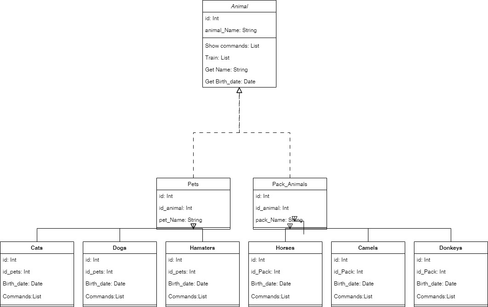

# GB_Final_Specialization

###Linux Commands

<details>
<summary> Задание 1:</summary>

```
wakhsavior@GB-Linux:~/GeekBrains/Final_Project$ cat >> Pets
Dogs
Cats
Hamsters
wakhsavior@GB-Linux:~/GeekBrains/Final_Project$ cat Pets
Dogs
Cats
Hamsters
wakhsavior@GB-Linux:~/GeekBrains/Final_Project$

wakhsavior@GB-Linux:~/GeekBrains/Final_Project$ cat >> Pack_Animals
Horses
Camels
Donkeys
wakhsavior@GB-Linux:~/GeekBrains/Final_Project$ cat Pack_Animals
Horses
Camels
Donkeys
wakhsavior@GB-Linux:~/GeekBrains/Final_Project$


wakhsavior@GB-Linux:~/GeekBrains/Final_Project$ cat P* | cat >> Friends
wakhsavior@GB-Linux:~/GeekBrains/Final_Project$ cat Friends
Horses
Camels
Donkeys
Dogs
Cats
Hamsters
wakhsavior@GB-Linux:~/GeekBrains/Final_Project$
```
</details>

<details>
<summary>Задание 2:</summary>

```
wakhsavior@GB-Linux:~/GeekBrains/Final_Project$ mkdir Animals
wakhsavior@GB-Linux:~/GeekBrains/Final_Project$ mv
Animals/      Friends       .git/         Pack_Animals  Pets          README.md
wakhsavior@GB-Linux:~/GeekBrains/Final_Project$ mv Friends Animals/
wakhsavior@GB-Linux:~/GeekBrains/Final_Project$
```
</details>

<details>
<summary>Задание 3:</summary>

```
wakhsavior@GB-Linux:~/GeekBrains/Final_Project$ wget https://dev.mysql.com/get/mysql-apt-config_0.8.26-1_all.deb
--2023-10-05 16:25:57--  https://dev.mysql.com/get/mysql-apt-config_0.8.26-1_all.deb
Resolving dev.mysql.com (dev.mysql.com)... 184.51.238.43, 2001:2030:21:1a9::2e31, 2001:2030:21:19e::2e31
Connecting to dev.mysql.com (dev.mysql.com)|184.51.238.43|:443... connected.
HTTP request sent, awaiting response... 302 Moved Temporarily
Location: https://repo.mysql.com//mysql-apt-config_0.8.26-1_all.deb [following]
--2023-10-05 16:25:58--  https://repo.mysql.com//mysql-apt-config_0.8.26-1_all.deb
Resolving repo.mysql.com (repo.mysql.com)... 2.22.239.224, 2a02:26f0:e2:782::1d68, 2a02:26f0:e2:780::1d68
Connecting to repo.mysql.com (repo.mysql.com)|2.22.239.224|:443... connected.
HTTP request sent, awaiting response... 200 OK
Length: 18088 (18K) [application/x-debian-package]
Saving to: ‘mysql-apt-config_0.8.26-1_all.deb’

mysql-apt-config_0.8.26-1_all.deb                          100%[=====================================================================================================================================>]  17,66K  --.-KB/s    in 0,001s

2023-10-05 16:25:58 (18,0 MB/s) - ‘mysql-apt-config_0.8.26-1_all.deb’ saved [18088/18088]

wakhsavior@GB-Linux:~/GeekBrains/Final_Project$ ls
Animals  mysql-apt-config_0.8.26-1_all.deb  Pack_Animals  Pets  README.md
wakhsavior@GB-Linux:~/GeekBrains/Final_Project$ sudo dpkg -i mysql-apt-config_0.8.26-1_all.deb
[sudo] password for wakhsavior:
Selecting previously unselected package mysql-apt-config.
(Reading database ... 251683 files and directories currently installed.)
Preparing to unpack mysql-apt-config_0.8.26-1_all.deb ...
Unpacking mysql-apt-config (0.8.26-1) ...
Setting up mysql-apt-config (0.8.26-1) ...

wakhsavior@GB-Linux:~/GeekBrains/Final_Project$ cat /etc/apt/sources.list.d/mysql.list
### THIS FILE IS AUTOMATICALLY CONFIGURED ###
# You may comment out entries below, but any other modifications may be lost.
# Use command 'dpkg-reconfigure mysql-apt-config' as root for modifications.
deb [signed-by=/usr/share/keyrings/mysql-apt-config.gpg] http://repo.mysql.com/apt/ubuntu/ jammy mysql-apt-config
deb [signed-by=/usr/share/keyrings/mysql-apt-config.gpg] http://repo.mysql.com/apt/ubuntu/ jammy mysql-8.0
deb [signed-by=/usr/share/keyrings/mysql-apt-config.gpg] http://repo.mysql.com/apt/ubuntu/ jammy mysql-tools
#deb [signed-by=/usr/share/keyrings/mysql-apt-config.gpg] http://repo.mysql.com/apt/ubuntu/ jammy mysql-tools-preview
deb-src [signed-by=/usr/share/keyrings/mysql-apt-config.gpg] http://repo.mysql.com/apt/ubuntu/ jammy mysql-8.0
wakhsavior@GB-Linux:~/GeekBrains/Final_Project$
```
</details>

<details>
<summary>Задание 4:</summary>

```
wakhsavior@GB-Linux:~/GeekBrains/Final_Project$ sudo apt update
Hit:1 http://ru.archive.ubuntu.com/ubuntu jammy InRelease
Get:2 http://ru.archive.ubuntu.com/ubuntu jammy-updates InRelease [119 kB]
Get:3 http://ru.archive.ubuntu.com/ubuntu jammy-backports InRelease [109 kB]
Hit:4 https://download.virtualbox.org/virtualbox/debian jammy InRelease
Hit:5 https://download.docker.com/linux/ubuntu jammy InRelease
Get:6 http://ru.archive.ubuntu.com/ubuntu jammy-updates/main amd64 Packages [1 056 kB]
Get:7 http://ru.archive.ubuntu.com/ubuntu jammy-updates/main i386 Packages [503 kB]
Get:8 http://ru.archive.ubuntu.com/ubuntu jammy-updates/main Translation-en [232 kB]
Get:9 http://ru.archive.ubuntu.com/ubuntu jammy-updates/main amd64 DEP-11 Metadata [101 kB]
Get:10 http://ru.archive.ubuntu.com/ubuntu jammy-updates/main amd64 c-n-f Metadata [15,6 kB]
Get:11 http://ru.archive.ubuntu.com/ubuntu jammy-updates/restricted amd64 Packages [969 kB]
Get:12 http://ru.archive.ubuntu.com/ubuntu jammy-updates/restricted i386 Packages [32,3 kB]
Get:13 http://ru.archive.ubuntu.com/ubuntu jammy-updates/restricted Translation-en [156 kB]
Get:14 http://ru.archive.ubuntu.com/ubuntu jammy-updates/restricted amd64 c-n-f Metadata [532 B]
Get:15 http://ru.archive.ubuntu.com/ubuntu jammy-updates/universe amd64 Packages [989 kB]
Get:16 http://ru.archive.ubuntu.com/ubuntu jammy-updates/universe i386 Packages [658 kB]
Get:17 http://ru.archive.ubuntu.com/ubuntu jammy-updates/universe Translation-en [216 kB]
Get:18 http://ru.archive.ubuntu.com/ubuntu jammy-updates/universe amd64 DEP-11 Metadata [291 kB]
Get:19 http://ru.archive.ubuntu.com/ubuntu jammy-updates/universe DEP-11 48x48 Icons [204 kB]
Get:20 http://ru.archive.ubuntu.com/ubuntu jammy-updates/universe DEP-11 64x64 Icons [311 kB]
Get:21 http://ru.archive.ubuntu.com/ubuntu jammy-updates/universe amd64 c-n-f Metadata [21,9 kB]
Get:22 http://ru.archive.ubuntu.com/ubuntu jammy-updates/multiverse amd64 Packages [41,6 kB]
Get:23 http://ru.archive.ubuntu.com/ubuntu jammy-updates/multiverse amd64 DEP-11 Metadata [940 B]
Get:24 http://ru.archive.ubuntu.com/ubuntu jammy-updates/multiverse amd64 c-n-f Metadata [472 B]
Get:25 http://ru.archive.ubuntu.com/ubuntu jammy-backports/main amd64 DEP-11 Metadata [4 940 B]
Get:26 http://ru.archive.ubuntu.com/ubuntu jammy-backports/universe i386 Packages [13,4 kB]
Get:27 http://ru.archive.ubuntu.com/ubuntu jammy-backports/universe amd64 Packages [24,3 kB]
Get:28 http://ru.archive.ubuntu.com/ubuntu jammy-backports/universe amd64 DEP-11 Metadata [17,9 kB]
Get:29 http://ru.archive.ubuntu.com/ubuntu jammy-backports/universe amd64 c-n-f Metadata [640 B]
Get:30 http://security.ubuntu.com/ubuntu jammy-security InRelease [110 kB]
Get:31 http://repo.mysql.com/apt/ubuntu jammy InRelease [20,3 kB]
Get:32 http://repo.mysql.com/apt/ubuntu jammy/mysql-8.0 Sources [963 B]
Get:33 http://repo.mysql.com/apt/ubuntu jammy/mysql-apt-config amd64 Packages [565 B]
Get:34 http://repo.mysql.com/apt/ubuntu jammy/mysql-apt-config i386 Packages [565 B]
Get:35 http://repo.mysql.com/apt/ubuntu jammy/mysql-8.0 amd64 Packages [12,7 kB]
Get:36 http://repo.mysql.com/apt/ubuntu jammy/mysql-tools amd64 Packages [8 011 B]
Get:37 http://repo.mysql.com/apt/ubuntu jammy/mysql-tools i386 Packages [457 B]
Get:38 http://security.ubuntu.com/ubuntu jammy-security/main i386 Packages [345 kB]
Get:39 http://security.ubuntu.com/ubuntu jammy-security/main amd64 Packages [856 kB]
Get:40 http://security.ubuntu.com/ubuntu jammy-security/main Translation-en [175 kB]
Get:41 http://security.ubuntu.com/ubuntu jammy-security/main amd64 DEP-11 Metadata [43,1 kB]
Get:42 http://security.ubuntu.com/ubuntu jammy-security/main amd64 c-n-f Metadata [11,4 kB]
Get:43 http://security.ubuntu.com/ubuntu jammy-security/restricted i386 Packages [32,0 kB]
Get:44 http://security.ubuntu.com/ubuntu jammy-security/restricted amd64 Packages [953 kB]
Get:45 http://security.ubuntu.com/ubuntu jammy-security/restricted Translation-en [154 kB]
Get:46 http://security.ubuntu.com/ubuntu jammy-security/restricted amd64 c-n-f Metadata [532 B]
Get:47 http://security.ubuntu.com/ubuntu jammy-security/universe i386 Packages [560 kB]
Get:48 http://security.ubuntu.com/ubuntu jammy-security/universe amd64 Packages [788 kB]
Get:49 http://security.ubuntu.com/ubuntu jammy-security/universe Translation-en [144 kB]
Get:50 http://security.ubuntu.com/ubuntu jammy-security/universe amd64 DEP-11 Metadata [40,1 kB]
Get:51 http://security.ubuntu.com/ubuntu jammy-security/universe amd64 c-n-f Metadata [16,7 kB]
Get:52 http://security.ubuntu.com/ubuntu jammy-security/multiverse amd64 Packages [36,5 kB]
Get:53 http://security.ubuntu.com/ubuntu jammy-security/multiverse amd64 c-n-f Metadata [260 B]
Fetched 10,4 MB in 7s (1 422 kB/s)
Reading package lists... Done
Building dependency tree... Done
Reading state information... Done

wakhsavior@GB-Linux:~/GeekBrains/Final_Project$ sudo apt install mysql-server
Reading package lists... Done
Building dependency tree... Done
Reading state information... Done
The following packages were automatically installed and are no longer required:
  libcgi-fast-perl libcgi-pm-perl libevent-pthreads-2.1-7 libfcgi-bin libfcgi-perl libfcgi0ldbl libhtml-template-perl libprotobuf-lite23
Use 'sudo apt autoremove' to remove them.
The following additional packages will be installed:
  mysql-client mysql-common mysql-community-client mysql-community-client-core mysql-community-client-plugins mysql-community-server mysql-community-server-core
The following packages will be REMOVED:
  mysql-client-8.0 mysql-client-core-8.0 mysql-server-8.0 mysql-server-core-8.0
The following NEW packages will be installed:
  mysql-client mysql-community-client mysql-community-client-core mysql-community-client-plugins mysql-community-server mysql-community-server-core
The following packages will be upgraded:
  mysql-common mysql-server
2 upgraded, 6 newly installed, 4 to remove and 131 not upgraded.
Need to get 30,7 MB of archives.
After this operation, 32,6 MB of additional disk space will be used.
Do you want to continue? [Y/n] y
Get:1 http://repo.mysql.com/apt/ubuntu jammy/mysql-8.0 amd64 mysql-server amd64 8.0.34-1ubuntu22.04 [66,4 kB]
Get:2 http://repo.mysql.com/apt/ubuntu jammy/mysql-8.0 amd64 mysql-common amd64 8.0.34-1ubuntu22.04 [67,7 kB]
Get:3 http://repo.mysql.com/apt/ubuntu jammy/mysql-8.0 amd64 mysql-community-client-plugins amd64 8.0.34-1ubuntu22.04 [1 435 kB]
Get:4 http://repo.mysql.com/apt/ubuntu jammy/mysql-8.0 amd64 mysql-community-client-core amd64 8.0.34-1ubuntu22.04 [2 087 kB]
Get:5 http://repo.mysql.com/apt/ubuntu jammy/mysql-8.0 amd64 mysql-community-client amd64 8.0.34-1ubuntu22.04 [2 113 kB]
Get:6 http://repo.mysql.com/apt/ubuntu jammy/mysql-8.0 amd64 mysql-client amd64 8.0.34-1ubuntu22.04 [66,4 kB]
Get:7 http://repo.mysql.com/apt/ubuntu jammy/mysql-8.0 amd64 mysql-community-server-core amd64 8.0.34-1ubuntu22.04 [24,8 MB]
Get:8 http://repo.mysql.com/apt/ubuntu jammy/mysql-8.0 amd64 mysql-community-server amd64 8.0.34-1ubuntu22.04 [78,2 kB]
Fetched 30,7 MB in 3s (8 898 kB/s)
Preconfiguring packages ...
(Reading database ... 251688 files and directories currently installed.)
Preparing to unpack .../mysql-server_8.0.34-1ubuntu22.04_amd64.deb ...
Unpacking mysql-server (8.0.34-1ubuntu22.04) over (8.0.34-0ubuntu0.22.04.1) ...
(Reading database ... 251692 files and directories currently installed.)
Removing mysql-server-8.0 (8.0.34-0ubuntu0.22.04.1) ...
update-alternatives: using /etc/mysql/my.cnf.fallback to provide /etc/mysql/my.cnf (my.cnf) in auto mode
Removing mysql-client-8.0 (8.0.34-0ubuntu0.22.04.1) ...
Removing mysql-client-core-8.0 (8.0.34-0ubuntu0.22.04.1) ...
Removing mysql-server-core-8.0 (8.0.34-0ubuntu0.22.04.1) ...
(Reading database ... 251489 files and directories currently installed.)
Preparing to unpack .../0-mysql-common_8.0.34-1ubuntu22.04_amd64.deb ...
Unpacking mysql-common (8.0.34-1ubuntu22.04) over (5.8+1.0.8) ...
Selecting previously unselected package mysql-community-client-plugins.
Preparing to unpack .../1-mysql-community-client-plugins_8.0.34-1ubuntu22.04_amd64.deb ...
Unpacking mysql-community-client-plugins (8.0.34-1ubuntu22.04) ...
Selecting previously unselected package mysql-community-client-core.
Preparing to unpack .../2-mysql-community-client-core_8.0.34-1ubuntu22.04_amd64.deb ...
Unpacking mysql-community-client-core (8.0.34-1ubuntu22.04) ...
Selecting previously unselected package mysql-community-client.
Preparing to unpack .../3-mysql-community-client_8.0.34-1ubuntu22.04_amd64.deb ...
Unpacking mysql-community-client (8.0.34-1ubuntu22.04) ...
Selecting previously unselected package mysql-client.
Preparing to unpack .../4-mysql-client_8.0.34-1ubuntu22.04_amd64.deb ...
Unpacking mysql-client (8.0.34-1ubuntu22.04) ...
Selecting previously unselected package mysql-community-server-core.
Preparing to unpack .../5-mysql-community-server-core_8.0.34-1ubuntu22.04_amd64.deb ...
Unpacking mysql-community-server-core (8.0.34-1ubuntu22.04) ...
Selecting previously unselected package mysql-community-server.
Preparing to unpack .../6-mysql-community-server_8.0.34-1ubuntu22.04_amd64.deb ...
Unpacking mysql-community-server (8.0.34-1ubuntu22.04) ...
Setting up mysql-common (8.0.34-1ubuntu22.04) ...
Installing new version of config file /etc/mysql/conf.d/mysql.cnf ...
Installing new version of config file /etc/mysql/my.cnf.fallback ...
Setting up mysql-community-server-core (8.0.34-1ubuntu22.04) ...
Setting up mysql-community-client-plugins (8.0.34-1ubuntu22.04) ...
Setting up mysql-community-client-core (8.0.34-1ubuntu22.04) ...
Setting up mysql-community-client (8.0.34-1ubuntu22.04) ...
Setting up mysql-client (8.0.34-1ubuntu22.04) ...
Setting up mysql-community-server (8.0.34-1ubuntu22.04) ...
Installing new version of config file /etc/apparmor.d/usr.sbin.mysqld ...
Installing new version of config file /etc/mysql/mysql.cnf ...

Configuration file '/etc/mysql/mysql.conf.d/mysqld.cnf'
 ==> Modified (by you or by a script) since installation.
 ==> Package distributor has shipped an updated version.
   What would you like to do about it ?  Your options are:
    Y or I  : install the package maintainer's version
    N or O  : keep your currently-installed version
      D     : show the differences between the versions
      Z     : start a shell to examine the situation
 The default action is to keep your current version.
*** mysqld.cnf (Y/I/N/O/D/Z) [default=N] ?
update-alternatives: using /etc/mysql/mysql.cnf to provide /etc/mysql/my.cnf (my.cnf) in auto mode
Setting up mysql-server (8.0.34-1ubuntu22.04) ...
Processing triggers for man-db (2.10.2-1) ...
Processing triggers for libc-bin (2.35-0ubuntu3.1) ...
wakhsavior@GB-Linux:~/GeekBrains/Final_Project$


wakhsavior@GB-Linux:~/GeekBrains/Final_Project$ sudo apt purge mysql-server
Reading package lists... Done
Building dependency tree... Done
Reading state information... Done
The following packages were automatically installed and are no longer required:
  libcgi-fast-perl libcgi-pm-perl libevent-pthreads-2.1-7 libfcgi-bin libfcgi-perl libfcgi0ldbl libhtml-template-perl libmecab2 libprotobuf-lite23 mecab-ipadic mecab-ipadic-utf8 mecab-utils mysql-client mysql-common
  mysql-community-client mysql-community-client-core mysql-community-client-plugins mysql-community-server mysql-community-server-core
Use 'sudo apt autoremove' to remove them.
The following packages will be REMOVED:
  mysql-server*
0 upgraded, 0 newly installed, 1 to remove and 131 not upgraded.
After this operation, 77,8 kB disk space will be freed.
Do you want to continue? [Y/n] y
(Reading database ... 251756 files and directories currently installed.)
Removing mysql-server (8.0.34-1ubuntu22.04) ...
wakhsavior@GB-Linux:~/GeekBrains/Final_Project$
```
</details>

<details>
<summary>Задание 5:</summary>

```
wakhsavior@GB-Linux:~/GeekBrains/Final_Project$ history
 1583  cd Final_Project/
 1584  ls
 1585  ls -la
 1586  git push -u origin main
 1587  ssh-keygen
 1588  git push -u origin main
 1589  ssh -vT git@github.com
 1590  cat /home/wakhsavior/.ssh/
 1591  cat /home/wakhsavior/.ssh/id_rsa
 1592  cat /home/wakhsavior/.ssh/id_rsa.pub
 1593  git push -u origin main
 1594  exit
 1595  cd GeekBrains/Final_Project/
 1596  ls
 1597  cat >> Pets
 1598  cat Pets
 1599  cat >> Pack_Animals
 1600  cat Pack_Animals
 1601  git checkout -b Linux_commands
 1602  git status
 1603  git log
 1604  git log --one-line
 1605  git log --one-lines
 1606  git log -one-lines
 1607  git log --all --one-line
 1608  git log --all
 1609  cat * | cat >> Friends
 1610  cat Friends
 1611  rm Friends
 1612  cat P* | cat >> Friends
 1613  cat Friends
 1614  cd Animals
 1615  mkdir Animals
 1616  mv Friends Animals/
 1617  wget https://dev.mysql.com/get/mysql-apt-config_0.8.26-1_all.deb
 1618  ls
 1619  sudo dpkg -i mysql-apt-config_0.8.26-1_all.deb
 1620  cat /etc/apt/sources.list
 1621  cat /etc/apt/sources.list.d/mysql.list
 1622  sudo apt update
 1623  sudo apt install mysql-server
 1624  sudo apt purge mysql-server
 1625  history >> history.list
```

</details>

###SQL

[SQL file commands](./Animals.sql)

<details>
<summary>Задание 6:</summary>
<picture>
 <source media="(prefers-color-scheme: dark)" srcset="YOUR-DARKMODE-IMAGE">
 
</picture>

</details>
<details>
<summary>Задание 7:</summary>

```
ql> show DATABASES;
+----------------------+
| Database             |
+----------------------+
| GB_SQL_Lesson_01     |
| GB_SQL_Lesson_02     |
| GB_SQL_Lesson_03     |
| GB_SQL_Lesson_04     |
| GB_SQL_Seminar_02_HW |
| GB_SQL_Seminar_03_HW |
| GB_SQL_Seminar_04    |
| GB_SQL_Seminar_04_HW |
| GB_SQL_Seminar_5     |
| GB_SQL_Seminar_5_HW  |
| Nursery              |
| information_schema   |
| mysql                |
| performance_schema   |
| sys                  |
| world                |
+----------------------+
16 rows in set (0,00 sec)

mysql> CREATE DATABASE human_friends;
Query OK, 1 row affected (0,04 sec)

mysql> show DATABASES;
+----------------------+
| Database             |
+----------------------+
| GB_SQL_Lesson_01     |
| GB_SQL_Lesson_02     |
| GB_SQL_Lesson_03     |
| GB_SQL_Lesson_04     |
| GB_SQL_Seminar_02_HW |
| GB_SQL_Seminar_03_HW |
| GB_SQL_Seminar_04    |
| GB_SQL_Seminar_04_HW |
| GB_SQL_Seminar_5     |
| GB_SQL_Seminar_5_HW  |
| Nursery              |
| human_friends        |
| information_schema   |
| mysql                |
| performance_schema   |
| sys                  |
| world                |
+----------------------+
17 rows in set (0,01 sec)

mysql>
``` 
</details>
<details>
<summary>Задание 8:</summary>

```
mysql> use human_friends;
Database changed

mysql> CREATE TABLE `human_friends`.`animal` (
    ->     `id` INT NOT NULL AUTO_INCREMENT,
    ->     `animal_name` VARCHAR(45) NOT NULL,
    ->     PRIMARY KEY (`id`));
Query OK, 0 rows affected (0,21 sec)

mysql> CREATE TABLE `human_friends`.`pets` (
    ->     `id` INT NOT NULL AUTO_INCREMENT,
    ->     `pets_name` VARCHAR(45) NOT NULL,
    -> `id_animal` INT,
    -> PRIMARY KEY (`id`));
Query OK, 0 rows affected (0,07 sec)

mysql> CREATE TABLE `human_friends`.`pack_Animals` (
    ->     `id` INT NOT NULL AUTO_INCREMENT,
    ->     `pack_Name` VARCHAR(45) NULL,
    ->     `id_animal` INT,
    -> PRIMARY KEY (`id`));
Query OK, 0 rows affected (0,07 sec)

mysql> CREATE TABLE `cats`(
    ->   `id` Int NOT NULL AUTO_INCREMENT,
    ->   `cat_name` Varchar(30) NOT NULL,
    ->   `date_birth` Date NOT NULL,
    ->   `commands` Varchar(300),
    ->   `id_pets` INT,
    -> PRIMARY KEY (`id`));
Query OK, 0 rows affected (0,07 sec)

mysql> CREATE TABLE `dogs`(
    ->   `id` Int NOT NULL AUTO_INCREMENT,
    ->   `dog_name` Varchar(30) NOT NULL,
    ->   `date_birth` Date NOT NULL,
    ->   `commands` Varchar(300),
    ->   `id_pets` INT,
    -> PRIMARY KEY (`id`));
Query OK, 0 rows affected (0,09 sec)

mysql> CREATE TABLE `hamsters`(
    ->   `id` Int NOT NULL AUTO_INCREMENT,
    ->   `hamster_name` Varchar(30) NOT NULL,
    ->   `date_birth` Date NOT NULL,
    ->   `commands` Varchar(300),
    ->   `id_pets` INT,
    -> PRIMARY KEY (`id`));
Query OK, 0 rows affected (0,08 sec)

mysql> CREATE TABLE `horses`(
    ->   `id` Int NOT NULL AUTO_INCREMENT,
    ->   `horse_name` Varchar(30) NOT NULL,
    ->   `date_birth` Date NOT NULL,
    ->   `commands` Varchar(300),
    ->   `id_pack_Animals` INT,
    -> PRIMARY KEY (`id`));
Query OK, 0 rows affected (0,07 sec)

mysql> CREATE TABLE `camels`(
    ->   `id` Int NOT NULL AUTO_INCREMENT,
    ->   `camel_name` Varchar(30) NOT NULL,
    ->   `date_birth` Date NOT NULL,
    ->   `commands` Varchar(300),
    ->   `id_pack_Animals` INT,
    -> PRIMARY KEY (`id`));
Query OK, 0 rows affected (0,07 sec)

mysql> CREATE TABLE `donkeys`(
    ->   `id` Int NOT NULL AUTO_INCREMENT,
    ->   `donkey_name` Varchar(30) NOT NULL,
    ->   `date_birth` Date NOT NULL,
    ->   `commands` Varchar(300),
    ->   `id_pack_Animals` INT,
    -> PRIMARY KEY (`id`));
Query OK, 0 rows affected (0,15 sec)

mysql> show tables; 
+-------------------------+
| Tables_in_human_friends |
+-------------------------+
| animal                  |
| camels                  |
| cats                    |
| dogs                    |
| donkeys                 |
| hamsters                |
| horses                  |
| pack_Animals            |
| pets                    |
+-------------------------+
9 rows in set (0,00 sec)

mysql> ALTER TABLE `pets` ADD FOREIGN KEY (`id_animal`) REFERENCES `animal` (`id`);
Query OK, 0 rows affected (2,15 sec)
Records: 0  Duplicates: 0  Warnings: 0

mysql> ALTER TABLE `pack_Animals` ADD FOREIGN KEY (`id_animal`) REFERENCES `animal` (`id`);
ALTER TABLE `cats` ADD FOREIGN KEY (`id_pets`) REFERENCES `pets` (`id`);
ALTER TABLE `dogs` ADD FOREIGN KEY (`id_pets`) REFERENCES `pets` (`id`);
ALTER TABLE `hamsters` ADD FOREIGN KEY (`id_pets`) REFERENCES `pets` (`id`);
ALTER TABLE `horses` ADD FOREIGN KEY (`id_pack_Animals`) REFERENCES `pack_Animals` (`id`);
ALTER TABLE `camels` ADD FOREIGN KEY (`id_pack_Animals`) REFERENCES `pack_Animals` (`id`);
ALTER TABLE `donkeys` ADD FOREIGN KEY (`id_pack_Animals`) REFERENCES `pack_Animals` (`id`);Query OK, 0 rows affected (0,17 sec)
Records: 0  Duplicates: 0  Warnings: 0

mysql> ALTER TABLE `cats` ADD FOREIGN KEY (`id_pets`) REFERENCES `pets` (`id`);
Query OK, 0 rows affected (0,14 sec)
Records: 0  Duplicates: 0  Warnings: 0

mysql> ALTER TABLE `dogs` ADD FOREIGN KEY (`id_pets`) REFERENCES `pets` (`id`);
Query OK, 0 rows affected (0,15 sec)
Records: 0  Duplicates: 0  Warnings: 0

mysql> ALTER TABLE `hamsters` ADD FOREIGN KEY (`id_pets`) REFERENCES `pets` (`id`);
Query OK, 0 rows affected (0,17 sec)
Records: 0  Duplicates: 0  Warnings: 0

mysql> ALTER TABLE `horses` ADD FOREIGN KEY (`id_pack_Animals`) REFERENCES `pack_Animals` (`id`);
Query OK, 0 rows affected (2,19 sec)
Records: 0  Duplicates: 0  Warnings: 0

mysql> ALTER TABLE `camels` ADD FOREIGN KEY (`id_pack_Animals`) REFERENCES `pack_Animals` (`id`);
Query OK, 0 rows affected (0,43 sec)
Records: 0  Duplicates: 0  Warnings: 0

mysql> ALTER TABLE `donkeys` ADD FOREIGN KEY (`id_pack_Animals`) REFERENCES `pack_Animals` (`id`);
Query OK, 0 rows affected (0,21 sec)
Records: 0  Duplicates: 0  Warnings: 0


```
</details>

<details>
<summary>Задание 9:</summary>

```
mysql> INSERT INTO animal (animal_name) VALUES ("Вьючные"), ("Домашние"); 
Query OK, 2 rows affected (1,74 sec)
Records: 2  Duplicates: 0  Warnings: 0


mysql> INSERT INTO pets (pets_name,id_animal)
    -> VALUES
    -> ("Кошки",1),
    -> ("Собаки",1),
    -> ("Хомяки",1);
Query OK, 3 rows affected (0,03 sec)
Records: 3  Duplicates: 0  Warnings: 0

mysql> INSERT INTO pack_Animals (pack_Name,id_animal)
    -> VALUES
    -> ("Лошади",2),
    -> ("Верблюды",2),
    -> ("Ослы",2);
Query OK, 3 rows affected (0,01 sec)
Records: 3  Duplicates: 0  Warnings: 0

mysql> INSERT INTO cats (cat_name,date_birth,commands,id_pets)
    -> VALUES
    -> ('Барсик', '2021-02-10', "сидеть, мяукать, спать", 1),
    -> ('Мурзик', '2022-04-15', "сидеть, мяукать, лежать", 1),
    -> ('Ванкувер', '2021-08-18', "бегать, мяукать, прыгать", 1);
Query OK, 3 rows affected (0,02 sec)
Records: 3  Duplicates: 0  Warnings: 0

mysql> INSERT INTO dogs (dog_name,date_birth,commands,id_pets)
    -> VALUES
    -> ('Барбос', '2022-11-04', "сидеть, гавкать, аппорт", 2),
    -> ('Шульц', '2019-08-21', "сидеть, гавкать, аппорт, фас", 2),
    -> ('Мухтар', '2020-11-28', "бегать, сидеть, гавкать, аппорт, фас", 2);
Query OK, 3 rows affected (0,04 sec)
Records: 3  Duplicates: 0  Warnings: 0

mysql> INSERT INTO hamsters (hamster_name,date_birth,commands,id_pets)
    -> VALUES
    -> ('Рыжик', '2023-07-04', "спать, есть, бегать в колесе", 3),
    -> ('Грэй', '2022-12-02', "спать, есть, бегать в колесе", 3),
    -> ('Зола', '2021-11-25', "спать, есть, бегать в колесе", 3);
Query OK, 3 rows affected (1,75 sec)
Records: 3  Duplicates: 0  Warnings: 0

mysql> INSERT INTO horses (horse_name,date_birth,commands,id_pack_Animals)
    -> VALUES
    -> ('Адонис', '2018-05-10', "Трусца, галоп, прыжок, подзыв, надевание/снятие аммуниции", 1),
    -> ('Дарко', '2019-08-11', "подзыв, надевание/снятие аммуниции, концентрация внимания", 1),
    -> ('Жаден', '2021-10-22', "подзыв, надевание/снятие аммуниции, концентрация внимания, Трусца, галоп", 1);
Query OK, 3 rows affected (0,02 sec)
Records: 3  Duplicates: 0  Warnings: 0

mysql> INSERT INTO camels (camel_name,date_birth,commands,id_pack_Animals)
    -> VALUES
    -> ('Базилик', '2022-05-12', "подзыв, надевание/снятие аммуниции, провоз аммуниции, опуститься на передние колени", 2),
    -> ('Зевс', '2020-06-10', "подзыв, надевание/снятие аммуниции, провоз аммуниции, опуститься на передние колени", 2),
    -> ('Нейрон', '2021-12-22', "подзыв, надевание/снятие аммуниции, провоз аммуниции, опуститься на передние колени", 2);
Query OK, 3 rows affected (0,04 sec)
Records: 3  Duplicates: 0  Warnings: 0

mysql> INSERT INTO donkeys (donkey_name,date_birth,commands,id_pack_Animals)
    -> VALUES
    -> ('Пират', '2018-04-22', "подзыв, надевание/снятие аммуниции, тащить плуг, тащить повозку", 3),
    -> ('Титан', '2020-07-23', "подзыв, надевание/снятие аммуниции, тащить плуг, тащить повозку", 3),
    -> ('Милан', '2022-11-10', "подзыв, надевание/снятие аммуниции, тащить плуг, тащить повозку", 3);
Query OK, 3 rows affected (0,03 sec)
Records: 3  Duplicates: 0  Warnings: 0


mysql> SELECT * FROM dogs
    -> ;
    -> ('Пират', '2018-04-22', "подзыв, надевание/снятие аммуниции, тащить плуг, тащить повозку", 3),
    -> ('Титан', '2020-07-23', "подзыв, надевание/снятие аммуниции, тащить плуг, тащить повозку", 3),
    -> ('Милан', '2022-11-10', "подзыв, надевание/снятие аммуниции, тащить плуг, тащить повозку", 3);
Query OK, 3 rows affected (0,02 sec)
Records: 3  Duplicates: 0  Warnings: 0
+----+--------------+------------+------------------------------------------------------------------+---------+
| id | dog_name     | date_birth | commands                                                         | id_pets |
+----+--------------+------------+------------------------------------------------------------------+---------+
|  1 | Барбос       | 2022-11-04 | сидеть, гавкать, аппорт                                          |       2 |
|  2 | Шульц        | 2019-08-21 | сидеть, гавкать, аппорт, фас                                     |       2 |
|  3 | Мухтар       | 2020-11-28 | бегать, сидеть, гавкать, аппорт, фас                             |       2 |
+----+--------------+------------+------------------------------------------------------------------+---------+
3 rows in set (0,00 sec)

mysql> SELECT * FROM pets;
+----+--------------+-----------+
| id | pets_name    | id_animal |
+----+--------------+-----------+
|  1 | Кошки        |         1 |
|  2 | Собаки       |         1 |
|  3 | Хомяки       |         1 |
+----+--------------+-----------+
3 rows in set (0,00 sec)

mysql> select * from camels;
+----+----------------+------------+------------------------------------------------------------------------------------------------------------------------------------------------------------+-----------------+
| id | camel_name     | date_birth | commands                                                                                                                                                   | id_pack_Animals |
+----+----------------+------------+------------------------------------------------------------------------------------------------------------------------------------------------------------+-----------------+
|  1 | Базилик        | 2022-05-12 | подзыв, надевание/снятие аммуниции, провоз аммуниции, опуститься на передние колени                                                                        |               2 |
|  2 | Зевс           | 2020-06-10 | подзыв, надевание/снятие аммуниции, провоз аммуниции, опуститься на передние колени                                                                        |               2 |
|  3 | Нейрон         | 2021-12-22 | подзыв, надевание/снятие аммуниции, провоз аммуниции, опуститься на передние колени                                                                        |               2 |
+----+----------------+------------+------------------------------------------------------------------------------------------------------------------------------------------------------------+-----------------+
3 rows in set (0,00 sec)

```
</details>
<details>
<summary>Задание 10:</summary>

```
mysql> DELETE  FROM camels; 
Query OK, 3 rows affected (0,02 sec)

mysql> select * from camels;
Empty set (0,00 sec)

mysql> SELECT name,commands,date_birth,pack_Name FROM horses join pack_Animals on id_pack_Animals=pack_Animals.id UNION SELECT name,commands,date_birth,pack_Name FROM donkeys join pack_Animals on id_pack_Animals=pack_Animals.id;
+--------------+---------------------------------------------------------------------------------------------------------------------------------------+------------+--------------+
| name         | commands                                                                                                                              | date_birth | pack_Name    |
+--------------+---------------------------------------------------------------------------------------------------------------------------------------+------------+--------------+
| Адонис       | Трусца, галоп, прыжок, подзыв, надевание/снятие аммуниции                                                                             | 2018-05-10 | Лошади       |
| Дарко        | подзыв, надевание/снятие аммуниции, концентрация внимания                                                                             | 2019-08-11 | Лошади       |
| Жаден        | подзыв, надевание/снятие аммуниции, концентрация внимания, Трусца, галоп                                                              | 2021-10-22 | Лошади       |
| Пират        | подзыв, надевание/снятие аммуниции, тащить плуг, тащить повозку                                                                       | 2018-04-22 | Ослы         |
| Титан        | подзыв, надевание/снятие аммуниции, тащить плуг, тащить повозку                                                                       | 2020-07-23 | Ослы         |
| Милан        | подзыв, надевание/снятие аммуниции, тащить плуг, тащить повозку                                                                       | 2022-11-10 | Ослы         |
+--------------+---------------------------------------------------------------------------------------------------------------------------------------+------------+--------------+
6 rows in set (0,00 sec)

```
</details>


<details>
<summary>Задание 11:</summary>

```
mysql> CREATE TABLE young_animals ( id INT NOT NULL, name varchar(50), `date_birth` Date NOT NULL, `commands` Varchar(300), `age` INT);
Query OK, 0 rows affected (0,16 sec)

mysql> INSERT INTO young_animals (id, name, date_birth, commands, age) SELECT id, name, date_birth, commands, timestampdiff(MONTH, date_birth, NOW()) as age FROM cats where timestampdiff(MONTH, date_birth, NOW()) BETWEEN 12 AND 36;
Query OK, 3 rows affected (0,04 sec)
Records: 3  Duplicates: 0  Warnings: 0

mysql> INSERT INTO young_animals (id, name, date_birth, commands, age) SELECT id, name, date_birth, commands, timestampdiff(MONTH, date_birth, NOW()) as age FROM dogs where timestampdiff(MONTH, date_birth, NOW()) BETWEEN 12 AND 36;
Query OK, 1 row affected (0,02 sec)
Records: 1  Duplicates: 0  Warnings: 0

mysql> INSERT INTO young_animals (id, name, date_birth, commands, age) SELECT id, name, date_birth, commands, timestampdiff(MONTH, date_birth, NOW()) as age FROM hamsters where timestampdiff(MONTH, date_birth, NOW()) BETWEEN 12 AND 36;
Query OK, 1 row affected (0,32 sec)
Records: 1  Duplicates: 0  Warnings: 0

mysql> INSERT INTO young_animals (id, name, date_birth, commands, age) SELECT id, name, date_birth, commands, timestampdiff(MONTH, date_birth, NOW()) as age FROM horses where timestampdiff(MONTH, date_birth, NOW()) BETWEEN 12 AND 36; 
Query OK, 1 row affected (0,01 sec)
Records: 1  Duplicates: 0  Warnings: 0

mysql> INSERT INTO young_animals (id, name, date_birth, commands, age) SELECT id, name, date_birth, commands, timestampdiff(MONTH, date_birth, NOW()) as age FROM camels where timestampdiff(MONTH, date_birth, NOW()) BETWEEN 12 AND 36; 
Query OK, 2 rows affected (0,01 sec)
Records: 2  Duplicates: 0  Warnings: 0

mysql> INSERT INTO young_animals (id, name, date_birth, commands, age) SELECT id, name, date_birth, commands, timestampdiff(MONTH, date_birth, NOW()) as age FROM donkeys where timestampdiff(MONTH, date_birth, NOW()) BETWEEN 12 AND 36;
Query OK, 0 rows affected (0,00 sec)
Records: 0  Duplicates: 0  Warnings: 0


mysql> SELECT * FROM young_animals;
+----+------------------+------------+------------------------------------------------------------------------------------------------------------------------------------------------------------+------+
| id | name             | date_birth | commands                                                                                                                                                   | age  |
+----+------------------+------------+------------------------------------------------------------------------------------------------------------------------------------------------------------+------+
|  1 | Барсик           | 2021-02-10 | сидеть, мяукать, спать                                                                                                                                     |   32 |
|  2 | Мурзик           | 2022-04-15 | сидеть, мяукать, лежать                                                                                                                                    |   17 |
|  3 | Ванкувер         | 2021-08-18 | бегать, мяукать, прыгать                                                                                                                                   |   25 |
|  3 | Мухтар           | 2020-11-28 | бегать, сидеть, гавкать, аппорт, фас                                                                                                                       |   34 |
|  3 | Зола             | 2021-11-25 | спать, есть, бегать в колесе                                                                                                                               |   22 |
|  3 | Жаден            | 2021-10-22 | подзыв, надевание/снятие аммуниции, концентрация внимания, Трусца, галоп                                                                                   |   23 |
|  1 | Базилик          | 2022-05-12 | подзыв, надевание/снятие аммуниции, провоз аммуниции, опуститься на передние колени                                                                        |   16 |
|  3 | Нейрон           | 2021-12-22 | подзыв, надевание/снятие аммуниции, провоз аммуниции, опуститься на передние колени                                                                        |   21 |
+----+------------------+------------+------------------------------------------------------------------------------------------------------------------------------------------------------------+------+
8 rows in set (0,00 sec)

```

</details>

<details>
<summary>Задание 12:</summary>

```
mysql> SELECT name,commands,date_birth,pack_Name as Animal FROM horses join pack_Animals on id_pack_Animals=pack_Animals.id
    -> UNION
    -> SELECT name,commands,date_birth,pack_Name as Animal FROM donkeys join pack_Animals on id_pack_Animals=pack_Animals.id
    -> UNION
    -> SELECT name,commands,date_birth,pets_name as Animal FROM cats join pets on id_pets=pets.id
    -> UNION
    -> SELECT name,commands,date_birth,pets_name as Animal FROM dogs join pets on id_pets=pets.id
    -> UNION
    -> SELECT name,commands,date_birth,pets_name as Animal FROM hamsters join pets on id_pets=pets.id;
+------------------+---------------------------------------------------------------------------------------------------------------------------------------+------------+--------------+
| name             | commands                                                                                                                              | date_birth | Animal       |
+------------------+---------------------------------------------------------------------------------------------------------------------------------------+------------+--------------+
| Адонис           | Трусца, галоп, прыжок, подзыв, надевание/снятие аммуниции                                                                             | 2018-05-10 | Лошади       |
| Дарко            | подзыв, надевание/снятие аммуниции, концентрация внимания                                                                             | 2019-08-11 | Лошади       |
| Жаден            | подзыв, надевание/снятие аммуниции, концентрация внимания, Трусца, галоп                                                              | 2021-10-22 | Лошади       |
| Пират            | подзыв, надевание/снятие аммуниции, тащить плуг, тащить повозку                                                                       | 2018-04-22 | Ослы         |
| Титан            | подзыв, надевание/снятие аммуниции, тащить плуг, тащить повозку                                                                       | 2020-07-23 | Ослы         |
| Милан            | подзыв, надевание/снятие аммуниции, тащить плуг, тащить повозку                                                                       | 2022-11-10 | Ослы         |
| Барсик           | сидеть, мяукать, спать                                                                                                                | 2021-02-10 | Кошки        |
| Мурзик           | сидеть, мяукать, лежать                                                                                                               | 2022-04-15 | Кошки        |
| Ванкувер         | бегать, мяукать, прыгать                                                                                                              | 2021-08-18 | Кошки        |
| Барбос           | сидеть, гавкать, аппорт                                                                                                               | 2022-11-04 | Собаки       |
| Шульц            | сидеть, гавкать, аппорт, фас                                                                                                          | 2019-08-21 | Собаки       |
| Мухтар           | бегать, сидеть, гавкать, аппорт, фас                                                                                                  | 2020-11-28 | Собаки       |
| Рыжик            | спать, есть, бегать в колесе                                                                                                          | 2023-07-04 | Хомяки       |
| Грэй             | спать, есть, бегать в колесе                                                                                                          | 2022-12-02 | Хомяки       |
| Зола             | спать, есть, бегать в колесе                                                                                                          | 2021-11-25 | Хомяки       |
+------------------+---------------------------------------------------------------------------------------------------------------------------------------+------------+--------------+
15 rows in set (0,00 sec)

```
</details>
<details>


### JAVA

<summary>Задание 13:</summary>

</details>


<details>
<summary>Задание 14:</summary>

</details>


<details>
<summary>Задание 15:</summary>

</details>

